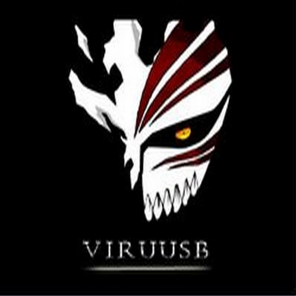

<h1 align="center"> [VIB] BOT MUSICAL </h1>

<h1 align="center">©ViruusB  </h1>
<h1 align="center">Serveur: https://discord.gg/YC4jNpeQkG </div></h1>

Invitation Bot: [[ViB]Music](https://discord.com/oauth2/authorize?client_id=749823254126133318&permissions=37080128&scope=bot)  


## 📝 LAST UPDATE 08 MAI 2021  
```  
        * Ajout du lien direct sur les titres
        * Update [playing.js]
        * Update de TOUTES les commandes
        * Ajout de logs
        * New visual [assets]
        * Update 2.8.9
```  

## 📝 UPDATE 28 MARS 2021  
```  
-> New visual update [ API ] [ViB]Music  
-> Debug / Update [lyrics.js]  
-> Update [play.js,playlist,js,queue.js,search.js]  
-> Add gestionnaire des pages [pagination.js]  
-> New package [soundcloud]  
-> SORTIE DE LA 2.5  
```


## 📝 [ViB]MusicBotDiscord  

VERSION v2.8.9  

[ViB]Music est un bot musical discord 🎧  


## 📝 Installation  

npm i -> Installation des modules nécessaire et de votre package.  

TOKEN -> Déjà programmé pour l'hebergement sur Heroku à modifier dans le .env  
PREFIX -> Déjà programmé pour l'hebergement sur Heroku à modifier dand le .env  


## 📝 [Support](https://discord.gg/YC4jNpeQkG)  

Vous avez une erreur ou un problème avec le code/bot? Rejoignez ce serveur et posez votre question au lieu de créer des problèmes, sauf s'il s'agit d'un bug de code. https://discord.gg/YC4jNpeQkG  


## 📸 Screenshots  

<div align="center"></div>
